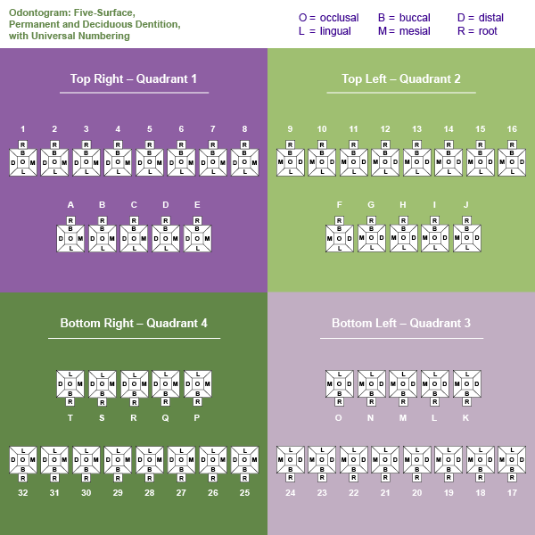
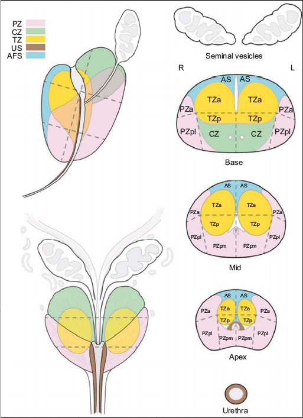
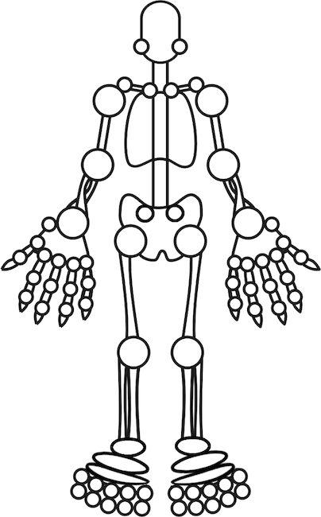
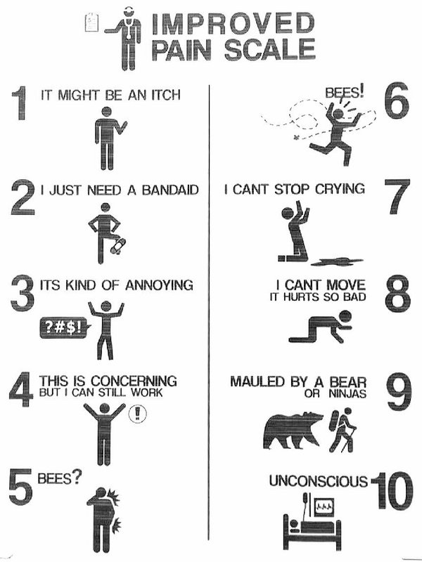

# REDCap module: Image Map
This REDCap module replaces an input, radio, or checkbox field with an image that users can interact with to select one or more options.  Specific applications include a body map (with over 70 body regions), a smile scale from 1-7 with facial expressions, and 3 representations of teeth and teeth surfaces. Future versions will allow admins and users to add additional maps via the module configuration. The module is tied to questions via the `@IMAGEMAP` action tag and the name of one of the pre-defined image maps.  e.g. `@IMAGEMAP=PAINMAP_FEMALE`

## Prerequisites
- REDCap >= 8.0.3 (for versions < 8.0.3, [REDCap Modules](https://github.com/vanderbilt/redcap-external-modules) is required).

## Easy Installation
- Obtain this module from the Consortium [REDCap Repo](https://redcap.vanderbilt.edu/consortium/modules/index.php) from the control center.

## Manual Installation
- Clone this repo into `<redcap-root>/modules/imagemap_v0.0`.
- Go to **Control Center > External Modules** and enable Pain Map.
- To activate this module for a particular project, go to the project home page, click on the **External Modules** link, and then enable Pain Map for that project.

## Features included
This module defines a new action tag: `@IMAGEMAP`. The possible values for this tag are `PAINMAP_MALE` (representation of a generic male body), `PAINMAP_FEMALE` (representation of a female body), etc. These names correspond to the following images:

**PAINMAP_MALE**

**PAINMAP_FEMALE**

**SMILE_SCALE**

**SINGLE_TOOTH**

**TEETH_SURFACE**

**TEETH**

**PI-RADS**

**RHEUMATOID_MAN**

The Rheumatoid man imagemap tool reflects disease activity and progression by recording joint involvement. It was designed for use in paediatric rheumatology, but can be used wherever joint mapping is required.  The Rheumatoid man is in anatomical position, which means a frontal depiction, but not mirrored. i.e., the left hand would be depicted on the right side of the screen.

**BEES (BONUS)**

## Usage
To display one of the images above in a survey or data entry form, add a new field of type **Text Box** and include one of the following options in the **Action Tags / Field Annotation (optional)** field:

    @IMAGEMAP=PAINMAP_MALE
    @IMAGEMAP=PAINMAP_FEMALE
    @IMAGEMAP=SMILE_SCALE
    @IMAGEMAP=SINGLE_TOOTH
    @IMAGEMAP=TEETH_SURFACE
    @IMAGEMAP=TEETH
    @IMAGEMAP=PIRADS
    @IMAGEMAP=RHEUMATOID_MAN
    @IMAGEMAP=BEES

Each region of an image is associated with a key, for example the "Ankle (front-left)" of the female body diagram is linked to the key "f34". To find a particular key for a body part, please refer to the html files (map files) located in the folder `maps`. After selecting multiple body parts, the field containing the action tag `@IMAGEMAP` will have as value a string of comma-separated keys, e.g. "f36,f17,f18,f21". Similarly, if using the faces diagram, the field containing the action tag (i.e. `@IMAGEMAP=SMILE_SCALE`) will have the value corresponding to the face clicked, which ranges from 1 to 7.

## Testing instrument

This project includes an [Example Instrument](docs/Instrument\ Example.zip) that includes everyone of these image maps. It demonstrates different methods of using these image maps.  This is suitable for testing or demonstration purposes.

## Acknowledgements
 * The original body was devised by Dr. Ming-Chih J Kao and Professor Sean Mackey at Stanford University as part of [CHOIR](choir.stanford.edu).  Use of the 'bodymap' images requires that the CHOIR attribution remains intact.
 * The imagemap plugin/hook was written at Stanford by Andrew Martin and converted to an external module in collaboration with CTS-IT - University of Florida.
 * The odontogram maps were contributed by Bas de Veer and collaborators at the ITHS and Christy McKinney at the University of Washington and Seattle Children’s Research Institute.
 * The PIRADS images were contributed by Dr. Richard Fan from Stanford University.
 * Rheumatoid Man was contributed by Blaine Vlantis of the University of Cape Town.
